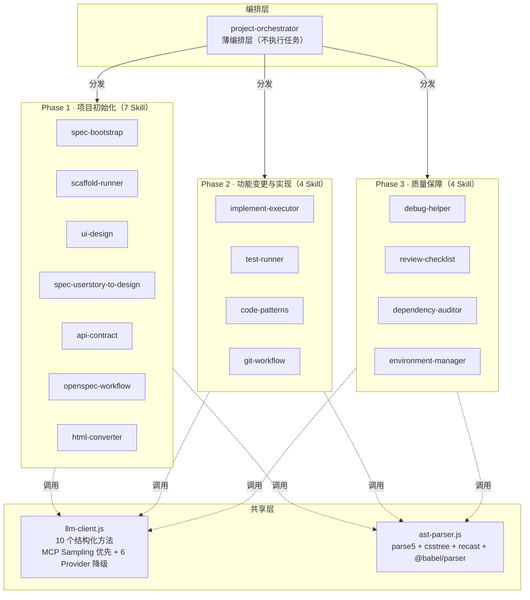

# project-orchestrator-bundle

> AI Agent 协作编排场景下的项目全生命周期管理 Skill Bundle — 15 个子 Skill，覆盖从需求到发布的完整链路。

[](https://github.com/LikeSimple/project-orchestrator-bundle/actions/workflows/ci.yml)
[](https://nodejs.org/)
[](https://modelcontextprotocol.io/)
[](LICENSE)

## 是什么

`project-orchestrator-bundle` 是一套**薄编排层 + 15 个专职子 Skill** 的设计模式。主入口 `project-orchestrator` 不直接执行任务，而是按三大阶段将工作分发到独立可调用的子 Skill：

| 阶段 | Skill 数 | 职责 |
|---|---|---|
| Phase 1 · 项目初始化 | 7 | 从需求到可运行工程 + 设计文档 |
| Phase 2 · 功能变更与实现 | 4 | 提案驱动变更 → 代码实现 → 测试 |
| Phase 3 · 质量保障 | 4 | 调试、代码审查、依赖审计、环境管理 |

### 15 个子 Skill 一览

| # | Skill | 阶段 | 职责 | 命令数 | LLM |
|---|---|---|---|---|---|
| 1 | spec-bootstrap | P1 | 项目初始化规范生成 | 8+ | ✅ |
| 2 | scaffold-runner | P1 | 技术栈脚手架生成（17 模板） | 6 | ✅ |
| 3 | ui-design | P1 | 单文件 HTML 原型 + 聊天调整 | 4 | ✅ |
| 4 | spec-userstory-to-design | P1 | User Story → Page Flow + Page Detail + OpenAPI | 2 | ✅ |
| 5 | api-contract | P1 | OpenAPI 3.1.2 契约生成 | 5 | ✅ |
| 6 | openspec-workflow | P1 | 提案驱动的变更管理 | 8+ | ✅ |
| 7 | html-converter | P1 | HTML 原型 → Vue/React 组件 | 4 | ✅ |
| 8 | implement-executor | P2 | Phase 驱动 LLM Agent 代码生成 | 7 | ✅ |
| 9 | test-runner | P2 | 多框架测试运行 + 覆盖率 + 生成 | 8 | ✅ |
| 10 | code-patterns | P2 | 22 种设计模式注入 | 5 | ✅ |
| 11 | git-workflow | P2 | Git 工作流（9 命令全实现） | 9 | ✅ |
| 12 | debug-helper | P3 | 三层根因分析 + LLM 深度诊断 | 5+ | ✅ |
| 13 | review-checklist | P3 | 73 条审查规则 + diff/file 审查 | 7 | ✅ |
| 14 | dependency-auditor | P3 | 真实 npm audit + License + 健康度 | 9 | ✅ |
| 15 | environment-manager | P3 | 4 环境 + Secrets 管理（dotenv / Doppler / Vault） | 10 | ✅ |

## 快速开始

### 选择 Bundle

`bundles/` 目录下提供 4 套预置 Bundle 清单（YAML），按角色选择即可：

| Bundle | 文件 | Skill 数 | 适合角色 |
|---|---|---|---|
| 完整 | `full-stack.yaml` | 15 | 全栈开发者 / 架构师（推荐） |
| 前端 | `frontend-only.yaml` | 子集 | 前端开发者 |
| API | `api-only.yaml` | 子集 | 后端 / API 开发者 |
| 设计 | `design-only.yaml` | 子集 | 产品经理 / 设计师 |

Bundle 清单是 YAML 描述文件，记录该 Bundle 包含哪些 Skill 及其角色。在 MCP 客户端（如 TRAE / Claude Code / Cursor）中注册 Bundle 时引用对应清单即可。详见下方[在 MCP 客户端中使用](#在-mcp-客户端中使用)。

### 在 MCP 客户端中使用

#### 前置：注册 MCP Server

将 `mcp-integration/mcp.json` 中的 MCP Server 配置注册到你的 MCP 客户端（TRAE / Claude Code / Cursor）。配置后，15 个子 Skill 会作为 MCP Tool 暴露，Agent 可自动调用。

TRAE 用户可直接使用 `mcp-integration/.trae.mcp.json`；其他客户端参考 `mcp.json` 中的 `command` / `args` / `env` 字段适配。

#### 一键启动（可选）

```bash
# Windows
cd mcp-integration && .\quickstart.ps1

# macOS / Linux
cd mcp-integration && ./quickstart.sh
```

脚本会自动执行 `npm install` → `npm run build` → `npm start`，启动 MCP Server。

#### Slash 命令用法

注册完成后，在 Claude Code / Cursor 中使用 slash 命令：

```bash
# 项目初始化（完整 Bootstrap 流程）
/project-orchestrator.bootstrap "我想做一个 SaaS 化的项目管理系统"

# 功能变更
/project-orchestrator.change "新增工时统计功能"

# UI 聊天调整
/project-orchestrator.ui-design --adjust
# 用户: "把首页卡片从 3 列改成 2 列，配色换成莫兰迪"

# HTML 转组件代码
/project-orchestrator.html-convert --from=prototype/index.html --target=react
```

### 命令行直接调用

```bash
# 构建后通过 skill-cli 调用任意子 Skill
cd mcp-integration && npm run build

# 示例：生成 OpenAPI 契约
node dist/skill-cli.cjs api-contract generate --input '{"name":"UserAPI","endpoints":[{"path":"/users","method":"get"}]}'

# 示例：审查代码 diff
node dist/skill-cli.cjs review-checklist diff --input '{"diffText":"diff --git ..."}'

# 示例：检测冲突文件
node dist/skill-cli.cjs git-workflow conflict --input '{"strategy":"manual"}'
```

## 目录结构

```
project-orchestrator-bundle/
├── SKILL.md                               # 主编排入口（15 Skill 概览）
├── README.md                              # 本文件
├── maturity-analysis-report.md            # 成熟度分析报告（v8）
├── .env.example                           # 环境变量模板
├── package.json                           # workspace 根配置
├── bundles/                               # Bundle 清单
│   ├── full-stack.yaml                    # 完整 Bundle（15 Skill）
│   ├── frontend-only.yaml                 # 前端 Bundle
│   ├── api-only.yaml                      # API Bundle
│   └── design-only.yaml                   # 设计 Bundle
├── skills/                                # 子 Skill 设计文档
│   ├── spec-bootstrap/SKILL.md
│   ├── scaffold-runner/SKILL.md
│   ├── ui-design/SKILL.md
│   ├── spec-userstory-to-design/SKILL.md
│   ├── api-contract/SKILL.md
│   ├── openspec-workflow/SKILL.md
│   ├── html-converter/SKILL.md
│   ├── implement-executor/SKILL.md
│   ├── test-runner/SKILL.md
│   ├── code-patterns/SKILL.md
│   ├── git-workflow/SKILL.md
│   ├── debug-helper/SKILL.md
│   ├── review-checklist/SKILL.md
│   ├── dependency-auditor/SKILL.md
│   └── environment-manager/SKILL.md
├── mcp-integration/                       # 实现 + MCP 集成
│   ├── package.json                       # 构建脚本 + 依赖
│   ├── tsconfig.json                      # TypeScript 配置
│   ├── mcp.json                           # MCP Server 配置
│   ├── .trae.mcp.json                     # TRAE MCP 配置
│   ├── quickstart.ps1                     # Windows 一键启动脚本
│   ├── quickstart.sh                      # macOS/Linux 一键启动脚本
│   ├── src/                               # 源码
│   │   ├── orchestrator-tools.ts          # MCP Tool 编排层（TypeScript）
│   │   └── skill-cli.cjs                  # 命令行入口（CommonJS）
│   ├── examples/                          # 源实现 + 示例
│   │   ├── lib/                           # 共享库
│   │   │   ├── llm-client.js             # 共享 LLM 客户端（6 Provider）
│   │   │   ├── ast-parser.js             # AST 解析器（parse5 + csstree + recast）
│   │   │   └── benchmark.js              # 性能基准测试
│   │   └── skills/                        # 15 个子 Skill 实现
│   │       ├── api-contract/index.js
│   │       ├── code-patterns/index.js
│   │       ├── debug-helper/index.js
│   │       ├── dependency-auditor/index.js
│   │       ├── environment-manager/index.js
│   │       ├── git-workflow/index.js
│   │       ├── html-converter/index.js
│   │       ├── implement-executor/index.js
│   │       ├── openspec-workflow/index.js
│   │       ├── review-checklist/index.js
│   │       ├── scaffold-runner/index.js
│   │       ├── spec-bootstrap/index.js
│   │       ├── spec-userstory-to-design/index.js
│   │       ├── test-runner/index.js
│   │       └── ui-design/index.js
│   ├── docs/                              # 文档
│   │   └── benchmarks/baseline.json       # 性能基线数据
│   └── dist/                              # 构建产物（npm run build 生成）
│       ├── skill-cli.cjs                  # 命令行入口
│       ├── orchestrator-tools.js         # MCP 入口
│       ├── lib/                           # 构建后的共享库
│       └── skills/                        # 构建后的 Skill
└── docs/                                  # 维护文档
    └── env-setup.md                       # 环境配置指南
```

## 构建与开发

```bash
cd mcp-integration

# 安装依赖
npm install

# 构建（TypeScript 编译 + 资产复制）
npm run build

# 开发模式（监听变更）
npm run dev

# 清理构建产物
npm run clean

# 启动 MCP 服务
npm start
```

## 配置

### 环境变量

复制 `.env.example` 为 `.env` 并按需修改。LLM API Key 为**可选**——不配置时自动降级到模板生成模式（`data.llmEnhanced: false`）。

| 变量 | 说明 | 必须？ |
|---|---|---|
| `NODE_ENV` | 运行环境（development / production） | ✅ |
| `APP_PORT` | 应用端口 | ✅ |
| `ANTHROPIC_API_KEY` | Anthropic Claude API Key | ⚠️ 可选 |
| `OPENAI_API_KEY` | OpenAI API Key | ⚠️ 可选 |
| `DEEPSEEK_API_KEY` | DeepSeek API Key | ⚠️ 可选 |
| `DASHSCOPE_API_KEY` | 通义千问 API Key | ⚠️ 可选 |
| `MOONSHOT_API_KEY` | 月之暗面 API Key | ⚠️ 可选 |
| `LLM_API_KEY` + `LLM_BASE_URL` | 自定义 OpenAI 兼容端点 | ⚠️ 可选 |
| `MCP_SAMPLING_ENABLED` | 设为 `1` 启用 MCP Sampling（首选，零配置） | ⚠️ 可选 |

> 完整环境配置指南详见 [docs/env-setup.md](docs/env-setup.md)。

## 测试与质量

```bash
# 运行全部测试（91 个测试）
npx mocha tests/phase1.test.cjs tests/phase2.test.cjs tests/phase3.test.cjs tests/e2e-pipeline.test.cjs --timeout 60000

# 运行 E2E 检查
node tests/e2e-check.cjs
```

### 测试覆盖

| 测试文件 | 测试数 | 覆盖范围 |
|---|---|---|
| `phase1.test.cjs` | ~30 | 7 个 Phase 1 Skill 的全部命令 |
| `phase2.test.cjs` | ~20 | 4 个 Phase 2 Skill 的全部命令 |
| `phase3.test.cjs` | ~29 | 4 个 Phase 3 Skill + AST 分析 + npm audit + Doppler/Vault |
| `e2e-pipeline.test.cjs` | 12 | 全链路：spec→scaffold→design→implement→test→git→review + 数据流传递 + AST 传播 |

### 质量保障措施

- **AST 解析 100% 覆盖**：15/15 个 Skill 全部使用 AST 解析（parse5 + csstree + recast + @babel/parser），无正则表达式解析
- **测试断言加固**：30 个弱断言已升级为深度数据字段断言（检查 `data` 关键字段值，而非仅检查 `ok` 类型）
- **Windows 兼容**：`spawnSync` + `shell: true` 替代 `execAsync`，修复 git-workflow / dependency-auditor / environment-manager 的 stdout pipe 问题
- **E2E 链路验证**：12 步全流程测试覆盖 spec→scaffold→design→implement→test→git→review，验证 Skill 间数据传递正确性

## LLM 集成

所有 15 个子 Skill 均集成了共享 LLM 客户端，采用 **MCP Sampling 优先 + 直连 Provider 降级** 策略：

### LLM 来源优先级

| 优先级 | 来源 | 条件 | provider 字段 |
|---|---|---|---|
| 1 🥇 | **MCP Sampling** | 通过 MCP Server 运行时（`MCP_SAMPLING_ENABLED=1`） | `mcp-sampling` |
| 2 🥈 | 直连 Provider（6 种） | API key 环境变量存在 | `anthropic` / `openai` / ... |
| 3 🥉 | 模板生成模式 | 无任何 LLM 来源 | `null`（`llmEnhanced: false`） |

### MCP Sampling（方案B · 推荐）

当 Skill 通过 orchestrator-tools MCP Server 调用时，LLM 请求会通过 IPC 转发到 TRAE Agent 框架，由 Agent 的 LLM 完成推理：

```
TRAE Agent (LLM)
    ↑ sampling/createMessage
orchestrator-tools MCP Server
    ↑ IPC (process.send / child.on)
skill-cli.cjs (forked 子进程)
    ↑ require()
llm-client.js → Skill 代码
```

- **零配置**：不需要设置任何 API key，自动使用 Agent 框架的 LLM
- **统一计费**：LLM 调用计入 Agent 框架的用量统计
- **无缝降级**：MCP Sampling 不可用时自动回退到直连 Provider

### 直连 Provider（备用）

当 MCP Sampling 不可用（独立运行 / Client 不支持）时，自动降级到直连 Provider，按以下优先级自动检测：

| Provider | 环境变量 | 默认模型 |
|---|---|---|
| Anthropic | `ANTHROPIC_API_KEY` | claude-3-5-sonnet-20241022 |
| OpenAI | `OPENAI_API_KEY` | gpt-4o-mini |
| DeepSeek | `DEEPSEEK_API_KEY` | deepseek-chat |
| Qwen (通义千问) | `DASHSCOPE_API_KEY` | qwen-plus |
| Moonshot (月之暗面) | `MOONSHOT_API_KEY` | moonshot-v1-8k |
| Custom | `LLM_API_KEY` + `LLM_BASE_URL` | gpt-4o-mini |

### LLM 客户端 API

```javascript
const llm = require('./lib/llm-client');

// 检查可用性（MCP Sampling 或任意 Provider）
if (llm.isAvailable()) { ... }

// 获取当前 Provider 名称
llm.getProviderName(); // 'mcp-sampling' | 'anthropic' | 'openai' | ...

// 通用 LLM 调用（自动选择最优来源）
const result = await llm.callLLM({
  system: 'You are a code generator',
  messages: [{ role: 'user', content: '...' }],
  maxTokens: 4096,
  temperature: 0.2,
});

// 专用接口
await llm.generateCode({ taskDescription, codePatterns, language, ... });
await llm.generateTests({ sourceCode, testFramework, ... });
await llm.reviewCode({ code, checklist, ... });
```

### 优雅降级

- MCP Sampling 不可用 → 自动降级到直连 Provider
- 无 API key → 自动回退到启发式规则 / 模板生成模式
- 所有降级静默执行，返回 `data.llmEnhanced: false`，不影响核心功能

## 架构概览



三层分析架构（每个 Skill 内部）：AST 预检测（精确事实）→ 代码模式分析（结构化识别）→ LLM 深度分析（上下文推理）。

## 核心工作流

### Phase 1 · 项目初始化

```
spec-bootstrap              → spec.md / plan.md / tasks.md
scaffold-runner             → 可运行工程（17 模板）
ui-design                   → prototype/index.html
spec-userstory-to-design    → docs/design/（Page Flow + Page Detail + OpenAPI）
api-contract                → contracts/openapi.yaml
html-converter              → components/*.tsx 或 *.vue
code-patterns               → .code-patterns.yaml（团队规范注入）
openspec-workflow           → openspec/changes/（变更提案）
```

### Phase 2 · 功能变更与实现

```
openspec-workflow           → PROPOSAL.md / SPEC delta / TASKS.md
implement-executor          → Phase 驱动 Agent 循环
  ├─ 解析 tasks.md（按 Phase 分组）
  ├─ LLM 生成代码 → 写文件 → 跑测试
  ├─ 失败反馈 → LLM 修复 → 重试（最多 3 次）
  ├─ Checkpoint 门禁（测试 + lint + tsc）
  └─ .implement-state.json 状态持久化
test-runner                 → 多框架测试 + 覆盖率
git-workflow                → branch / commit / merge / release
```

### Phase 3 · 质量保障

```
debug-helper                → 三层根因分析 + LLM 深度诊断
review-checklist            → 73 条规则审查（7 大类）
dependency-auditor          → npm audit + License + 健康度评分
environment-manager         → 4 环境 + Secrets 管理 + 校验
```

## 设计理念

### 为什么是 Bundle 而不是单 Skill？

| 维度 | 单 Skill（巨石） | Skill Bundle（本方案） |
|---|---|---|
| SKILL.md 行数 | > 500 行，难以读完 | 每个 < 200 行 |
| 可复用性 | 整体打包，无法单点复用 | 子 Skill 独立上架 Marketplace |
| 权限隔离 | 按最大公约数给 | 按需最小化 |
| 故障隔离 | 一处挂全挂 | 局部失败不影响整体 |
| 版本演进 | 必须等大版本 | 子 Skill 独立小版本 |
| 学习曲线 | 一份长文档 | 多份短文档，每份聚焦 |

### 统一的返回结构

所有 15 个子 Skill 遵循标准 JSON I/O 协议：

```json
{
  "ok": true,
  "error": null,
  "data": {
    "summary": "操作摘要",
    "llmEnhanced": true,
    "llmProvider": "anthropic"
  },
  "warnings": [],
  "nextActions": []
}
```

### 命令别名

每个 Skill 的命令名对齐设计文档，同时保留常用别名：

```bash
# 设计文档命令名和别名均可使用
skill-cli code-patterns show          # 等同于 list
skill-cli code-patterns inject        # 等同于 generate
skill-cli scaffold-runner scaffold     # 等同于 run
skill-cli implement-executor run      # Phase 驱动编排
skill-cli git-workflow conflict        # 冲突检测
```

## 各 Skill 实现详情

### Phase 1 · 项目初始化（7 个）

| Skill | 核心命令 | 关键能力 |
|---|---|---|
| **spec-bootstrap** | constitution, init, plan, tasks, research, data-model, spec-quality | 生成项目宪法、spec/plan/tasks 三件套 |
| **scaffold-runner** | run, list, inspect, custom, addDep, enhance | 17 个模板（React/Vue/Next/Nuxt/Express/Nest/Koa/Spring Boot/FastAPI/Go/Rust/Flutter/.NET/Django/vitest/ts-lib/node-cli） |
| **ui-design** | generate, adjust, audit, beautify | 单文件 HTML 原型 + 聊天式调整 |
| **spec-userstory-to-design** | generate, validate | User Story → 4 页面 + 11 章节 Page Detail + OpenAPI 3.1.2 + Mermaid 流程图 + 覆盖度校验 |
| **api-contract** | generate, validate, merge, mock, enhance | OpenAPI 3.1.2 + RFC 9457 Problem + Bearer JWT |
| **openspec-workflow** | list, propose, apply, archive, show, status, delta, tasks | 提案 → 归档完整生命周期 |
| **html-converter** | convert, split, types, beautify | 表单字段识别 + 组件拆分 + React TSX / Vue 3 SFC + TypeScript 类型 |

### Phase 2 · 功能变更与实现（4 个）

| Skill | 核心命令 | 关键能力 |
|---|---|---|
| **implement-executor** | run, resume, checkpoint, abort, task, batch, status | Phase 解析 + LLM Agent 重试循环 + Checkpoint 门禁 + .implement-state.json + Git commit + 最终报告 |
| **test-runner** | run, coverage, report, list, init, generate, contract, detect | 6 种框架检测（vitest/jest/mocha/cypress/playwright/karma）+ 用例统计 + LLM 测试生成 |
| **code-patterns** | init, list, generate, apply, explain | 22 种模式（创建型 5 + 结构型 5 + 行为型 7 + 前端特有 5）+ 4 框架（React/Vue3/TS/Node.js） |
| **git-workflow** | commit, pr, summarize, conflict, tag, release, branch, merge, changelog | 9 命令全实现：冲突三级分类 + Conventional Commits + Keep a Changelog + GitHub Release |

### Phase 3 · 质量保障（4 个）

| Skill | 核心命令 | 关键能力 |
|---|---|---|
| **debug-helper** | analyze, trace, logs, bisect, history | 三层根因分析（表面/直接/根本）+ LLM 深度诊断 + bisect 二分定位 |
| **review-checklist** | review, checklist, explain, diff, file, approve, request-changes | 73 条规则（7 大类：BIZ/CONTRACT/SEC/PERF/MAINT/TEST/PATTERN）+ 每条含 bad/good 示例 |
| **dependency-auditor** | audit, outdated, licenses, report, summary, check, advisory, migrate, explain | **真实 npm audit**（`npm audit --json`，解析 npm 7+ 格式 CVE 数据）+ License 分类（permissive/copyleft/proprietary）+ 健康度 0-100 + 废弃检测 |
| **environment-manager** | init, switch, list, validate, secrets, diff, set, get, inject, suggest | 4 环境（dev/test/staging/prod）+ **三后端 Secrets 管理**（dotenv / Doppler / Vault）+ 20+ 敏感字段检测 + `secrets sync` 从外部后端拉取密钥到本地 |

## 外部依赖

Bundle **不依赖 SpecKit 或 OpenSpec CLI 工具**。它借鉴了这两个工具的工作流设计和文件结构约定，但全部 15 个 Skill 都是自研 JS 实现。

### 运行时依赖

| 依赖 | 类型 | 必须？ | 说明 |
|---|---|---|---|
| Node.js 18+ | 运行时 | ✅ 必须 | 唯一硬依赖 |
| Git | CLI | ⚠️ 可选 | git-workflow / openspec-workflow 需要，其他 Skill 不需要 |
| npm | CLI | ⚠️ 可选 | test-runner / dependency-auditor / scaffold-runner 需要 |
| LLM API Key | 网络 | ⚠️ 可选 | 无则降级到启发式模式，`data.llmEnhanced: false` |
| GitHub CLI (gh) | CLI | ⚠️ 可选 | git-workflow 的 pr/release 需要，无则跳过 |
| Doppler CLI | CLI | ⚠️ 可选 | environment-manager 的 `backend=doppler` 需要，无则降级到 dotenv |
| Vault CLI | CLI | ⚠️ 可选 | environment-manager 的 `backend=vault` 需要，无则降级到 dotenv |

### "借鉴" 而非 "依赖"

| 工具 | 原版 | 本 Bundle |
|---|---|---|
| SpecKit | 调用 `specify` CLI 生成 spec.md | 自研 JS + 正则 + 模板 + LLM 生成 spec.md |
| OpenSpec | 调用 `openspec` CLI 管理提案 | 自研 JS + fs 读写管理 openspec/changes/ 目录 |

兼容点：命令名（constitution/specify/plan/tasks）、产物路径（`.specify/memory/`、`openspec/changes/`）、流程（propose → delta → tasks → apply → archive）与原版一致，便于团队在自研实现和原版工具之间无缝切换。

## 技术栈

| 层 | 选型 |
|---|---|
| 规范驱动 | 兼容 SpecKit 工作流设计（自研实现，不依赖 SpecKit CLI） |
| 变更管理 | 兼容 OpenSpec 工作流设计（自研实现，不依赖 OpenSpec CLI） |
| LLM 集成 | **MCP Sampling（首选）** + 6 Provider 降级（Anthropic / OpenAI / DeepSeek / Qwen / Moonshot / Custom） |
| 构建系统 | TypeScript 5.5+ tsc + postbuild.js |
| MCP 集成 | @modelcontextprotocol/sdk 0.6+（tools + sampling） |
| AST 解析 | parse5 (HTML) · css-tree (CSS) · recast (JS/TS) · @babel/parser (TS 校验) — **43 个 API，15/15 Skill 100% 迁移** |
| 文档图 | Mermaid v11+ |
| API 规范 | OpenAPI 3.1.2 + JSON Schema 2020-12 |
| 错误响应 | RFC 9457 Problem Details |
| 代码规范 | Conventional Commits 1.0 |
| 变更日志 | Keep a Changelog 1.1 |

## 项目成熟度

当前成熟度：**96%**（Phase 3 · Beta 后期，稳定）— 详见 [maturity-analysis-report.md](maturity-analysis-report.md)

| 维度 | 评分 |
|---|---|
| 设计文档完整度 | 96% |
| 实际代码实现度 | 93% |
| MCP 集成方案 | 98% |
| Bundle 配置 | 95% |
| 架构设计合理性 | 98% |

### v8 已修复的关键问题

- ✅ LLM 全量深度集成（15/15 Skill 使用结构化 LLM 方法，0 个未结构化）
- ✅ 三层分析架构落地（AST 预检测 → 代码模式分析 → LLM 深度分析）
- ✅ llm-client.js 方法体系扩展到 10 个结构化方法（新增 `analyzeError`）
- ✅ pipeline 断点恢复机制（resume / rollback / abort + 重试预算 + 状态验证）
- ✅ 性能基线数据（benchmark.js + baseline.json，AST 解析 < 3ms）
- ✅ AST 解析 100% 覆盖（15/15 Skill 迁移到 parse5 + csstree + recast + @babel/parser）
- ✅ 端到端链路测试（12 步全流程验证 + AST 传播校验）
- ✅ dependency-auditor 真实 npm audit（`npm audit --json` + CVE 解析）
- ✅ environment-manager Doppler/Vault 集成（三后端 Secrets 管理）
- ✅ 测试断言加固（30 个弱断言升级为深度数据字段断言）
- ✅ Windows 兼容性（`spawnSync` + `shell: true` 修复 stdout pipe 问题）
- ✅ MCP Sampling 全链路（LLM 请求复用 Agent 框架 LLM）

## 许可

MIT

## 贡献

欢迎贡献！请通过 GitHub Issue 提交问题或建议，或直接提交 Pull Request。
