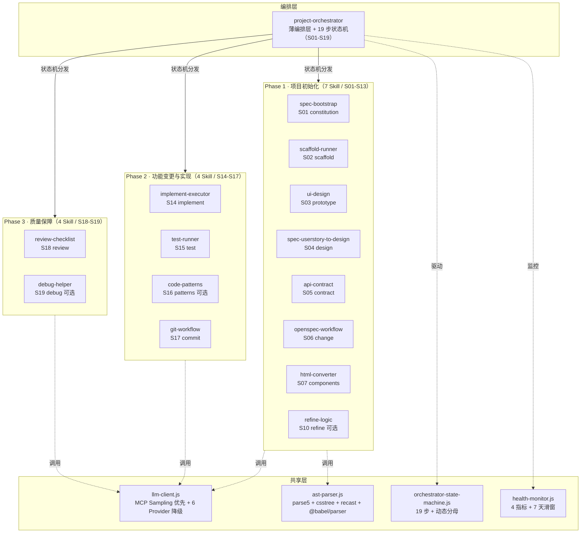

# project-orchestrator-bundle

> AI Agent 协作编排场景下的项目全生命周期管理 Skill Bundle — 15 个子 Skill + 19 步编排状态机 + 32 MCP Tools，覆盖从需求到发布的完整链路。

[](https://github.com/LikeSimple/project-orchestrator-bundle/actions/workflows/ci.yml)
[](https://nodejs.org/)
[](https://modelcontextprotocol.io/)
[](mcp-integration/tests)
[](maturity-analysis-report.md)
[](LICENSE)

## 是什么

`project-orchestrator-bundle` 是一套**薄编排层 + 15 个专职子 Skill** 的设计模式。主入口 `project-orchestrator` 不直接执行任务，而是按 **19 步编排状态机**将工作分发到独立可调用的子 Skill：

| 阶段 | Skill 数 | 步骤数 | 职责 |
|---|---|---|---|
| Phase 1 · 项目初始化 | 7 | S01-S12（12 步，10 必做 + 2 可选） | 从需求到可运行工程 + 设计文档 |
| Phase 2 · 功能变更与实现 | 4 | S13-S16（4 步必做） | 提案驱动变更 → 代码实现 → 测试 |
| Phase 3 · 质量保障 | 4 | S17-S19（1 必做 + 2 可选） | 代码审查、依赖审计、环境管理 |

> 编排状态机共 19 步（15 必做 + 4 可选），CLI 的 `requiredTotal` 动态计算=15（无需手改分母）。详见 [SKILL.md §8.2 编排状态机](SKILL.md)。

### 15 个子 Skill 一览

| # | Skill | 阶段 | 职责 | 命令数 | LLM |
|---|---|---|---|---|---|
| 1 | spec-bootstrap | P1 | 项目初始化规范生成 | 8+ | ✅ |
| 2 | scaffold-runner | P1 | 技术栈脚手架生成（17 模板） | 6 | ✅ |
| 3 | ui-design | P1 | 单文件 HTML 原型 + 聊天调整 | 4 | ✅ |
| 4 | spec-userstory-to-design | P1 | User Story → Page Flow + Page Detail + OpenAPI | 2 | ✅ |
| 5 | api-contract | P1 | OpenAPI 3.1.2 契约生成 | 5 | ✅ |
| 6 | openspec-workflow | P1 | 提案驱动的变更管理 | 8+ | ✅ |
| 7 | html-converter | P1 | HTML 原型 → Vue/React 组件 | 4 | ✅ |
| 8 | implement-executor | P2 | Phase 驱动 LLM Agent 代码生成 | 7 | ✅ |
| 9 | test-runner | P2 | 多框架测试运行 + 覆盖率 + 生成 | 8 | ✅ |
| 10 | code-patterns | P2 | 22 种设计模式注入 | 5 | ✅ |
| 11 | git-workflow | P2 | Git 工作流（9 命令全实现） | 9 | ✅ |
| 12 | debug-helper | P3 | 三层根因分析 + LLM 深度诊断 | 5+ | ✅ |
| 13 | review-checklist | P3 | 73 条审查规则 + diff/file 审查 | 7 | ✅ |
| 14 | dependency-auditor | P3 | 真实 npm audit + License + 健康度 | 9 | ✅ |
| 15 | environment-manager | P3 | 4 环境 + Secrets 管理（dotenv / Doppler / Vault） | 10 | ✅ |

### 关于 MCP 和 Skill Bundle

[Model Context Protocol (MCP)](https://modelcontextprotocol.io/) 是 AI Agent 与外部工具通信的开放标准。**Skill Bundle** 是一组遵循 MCP 规范的工具集合，以薄编排层分发任务到多个专职子 Skill——每个子 Skill 独立可调用、独立可上架。

本 Bundle 需要一个支持 MCP 的客户端（如 TRAE / Claude Code / Cursor）来加载和调用。加载后，**32 个 MCP Tools** 会作为编排层接口暴露给 Agent，Agent 按需自动调用，编排层按状态机依赖关系分发到 15 个子 Skill。

> **MCP SDK 版本**：`@modelcontextprotocol/sdk` 0.6+，stdio 传输使用 **NDJSON 协议**（每行一个 JSON，`\n` 分隔），协议版本 `2024-11-05`。

## 前置条件

| 依赖 | 版本 | 必须？ | 说明 |
|---|---|---|---|
| **Node.js** | 18+ | ✅ 必须 | 唯一硬依赖 |
| **MCP 客户端** | — | ✅ 必须 | TRAE / Claude Code / Cursor 任选其一 |
| Git | — | ⚠️ 可选 | git-workflow / openspec-workflow 需要 |
| npm | — | ⚠️ 可选 | 构建和安装依赖需要 |
| LLM API Key | — | ⚠️ 可选 | 无则降级到模板模式（`llmEnhanced: false`） |
| GitHub CLI (gh) | — | ⚠️ 可选 | git-workflow 的 pr / release 需要 |
| Doppler CLI | — | ⚠️ 可选 | environment-manager 的 `backend=doppler` 需要 |
| Vault CLI | — | ⚠️ 可选 | environment-manager 的 `backend=vault` 需要 |

> 没有可选依赖时，对应 Skill 会自动降级或跳过，不影响其他 Skill 使用。

## 快速开始

### 选择 Bundle

`bundles/` 目录下提供 4 套预置 Bundle 清单（YAML），按角色选择即可：

| Bundle | 文件 | Skill 数 | 适合角色 |
|---|---|---|---|
| 完整 | `full-stack.yaml` | 15 | 全栈开发者 / 架构师（推荐） |
| 前端 | `frontend-only.yaml` | 子集 | 前端开发者 |
| API | `api-only.yaml` | 子集 | 后端 / API 开发者 |
| 设计 | `design-only.yaml` | 子集 | 产品经理 / 设计师 |

Bundle 清单是 YAML 描述文件，记录该 Bundle 包含哪些 Skill 及其角色。在 MCP 客户端（如 TRAE / Claude Code / Cursor）中注册 Bundle 时引用对应清单即可。详见下方[在 MCP 客户端中使用](#在-mcp-客户端中使用)。

### 在 MCP 客户端中使用

#### 前置：注册 MCP Server

将 MCP Server 配置注册到你的 MCP 客户端（TRAE / Claude Code / Cursor）。配置后，**32 个 MCP Tools** 会作为编排层接口暴露，Agent 按需自动调用，编排层分发到 15 个子 Skill。

- **TRAE 用户**：直接使用 [`mcp-integration/.trae.mcp.json`](mcp-integration/.trae.mcp.json) 或项目根 `.trae/mcp.json`（quickstart 脚本自动写入，UTF-8 无 BOM 格式）
- **其他客户端**：参考 [`mcp-integration/mcp.json`](mcp-integration/mcp.json) 中的 `command` / `args` / `env` 字段适配

> **配置关键**：`PROJECT_ROOT` 指向目标项目（产物生成位置），`SKILL_BUNDLE_PATH` 指向本 Bundle 目录（工具代码位置）。详见[跨项目复用](#跨项目复用一套-bundle多个项目)。

#### 一键启动（可选）

```bash
# Windows
cd mcp-integration && .\quickstart.ps1

# macOS / Linux
cd mcp-integration && ./quickstart.sh
```

脚本会自动执行 `npm install` → `npm run build` → `npm start`，启动 MCP Server。

> quickstart 脚本以**增量合并**模式写入 `.trae/mcp.json`（仅新增 `orchestrator-tools` server，不覆盖现有配置）。如配置变更后 MCP Host 未识别新工具，需手动重启 MCP Server。

#### 编排状态机用法（CLI 直跑）

```bash
cd mcp-integration/tests

# 查看编排状态（19 步进度 + nextActions 引导）
node cli-orchestrator-status.cjs <projectRoot> status

# 重算状态（id 变更或文件系统变更后）
node cli-orchestrator-status.cjs <projectRoot> recompute

# 健康度仪表盘（4 指标 + 7 天滑窗）
node cli-orchestrator-status.cjs <projectRoot> dashboard
```

#### Slash 命令用法

注册完成后，在 Claude Code / Cursor 中使用 slash 命令：

```bash
# 项目初始化（完整 Bootstrap 流程）
/project-orchestrator.bootstrap "我想做一个 SaaS 化的项目管理系统"

# 功能变更
/project-orchestrator.change "新增工时统计功能"

# UI 聊天调整
/project-orchestrator.ui-design --adjust
# 用户: "把首页卡片从 3 列改成 2 列，配色换成莫兰迪"

# HTML 转组件代码
/project-orchestrator.html-converter --from=prototype/index.html --target=react
```

### 命令行直接调用

```bash
# 构建后通过 skill-cli 调用任意子 Skill
cd mcp-integration && npm run build

# 示例：生成 OpenAPI 契约
node dist/skill-cli.cjs api-contract generate --input '{"name":"UserAPI","endpoints":[{"path":"/users","method":"get"}]}'

# 示例：审查代码 diff
node dist/skill-cli.cjs review-checklist diff --input '{"diffText":"diff --git ..."}'

# 示例：检测冲突文件
node dist/skill-cli.cjs git-workflow conflict --input '{"strategy":"manual"}'
```

### 跨项目复用：一套 Bundle，多个项目

Skill Bundle 只需安装构建一次，即可在任意项目中复用。核心是区分两个路径：

| 环境变量 | 含义 | 示例 |
|---|---|---|
| `SKILL_BUNDLE_PATH` | Skill Bundle 本身的位置（工具代码在哪） | `D:/tools/project-orchestrator-bundle` |
| `PROJECT_ROOT` | 当前目标项目根目录（你要开发的项目） | `D:/work/my-new-app` |

**在新项目中使用：**

```bash
# 方式一：用 quickstart 脚本自动配置（推荐）
cd my-new-app

# Windows
..\project-orchestrator-bundle\mcp-integration\quickstart.ps1 -MCP trae

# macOS / Linux
bash ../project-orchestrator-bundle/mcp-integration/quickstart.sh --mcp=trae
```

脚本会自动在新项目的 `.trae/mcp.json` 中写入配置：
- `args` 指向 Skill Bundle 的 `orchestrator-tools.js`（复用同一份工具代码）
- `PROJECT_ROOT` 指向当前新项目（产物生成在项目内）
- `SKILL_BUNDLE_PATH` 指向 Skill Bundle 目录

```bash
# 方式二：手动配置 .trae/mcp.json
{
  "mcpServers": {
    "orchestrator-tools": {
      "command": "node",
      "args": ["D:/tools/project-orchestrator-bundle/mcp-integration/dist/orchestrator-tools.js"],
      "env": {
        "PROJECT_ROOT": "${workspaceFolder}",
        "SKILL_BUNDLE_PATH": "D:/tools/project-orchestrator-bundle"
      }
    }
  }
}
```

> **验证**：调用 `spec_bootstrap_constitution` 后，检查 **新项目目录**下是否生成了 `.specify/memory/constitution.md`。生成在新项目里 = 配置正确；生成在 Skill Bundle 目录里 = `PROJECT_ROOT` 设错了。

## 目录结构

```
project-orchestrator-bundle/
├── SKILL.md                               # 主编排入口（15 Skill 概览 + 19 步状态机 + 新 Skill 注册流程）
├── README.md                              # 本文件
├── maturity-analysis-report.md            # 成熟度分析报告（v10，93.4%，10 维度）
├── .env.example                           # 环境变量模板
├── package.json                           # workspace 根配置
├── bundles/                               # Bundle 清单（4 套预置）
│   ├── full-stack.yaml                    # 完整 Bundle（15 Skill）
│   ├── frontend-only.yaml                 # 前端 Bundle
│   ├── api-only.yaml                      # API Bundle
│   └── design-only.yaml                   # 设计 Bundle
├── skills/                                # 15 个子 Skill 设计文档（SKILL.md）
├── contracts/                             # API 契约（S11 正式产物）
│   └── openapi.yaml                       # OpenAPI 3.1.2
├── specs/                                 # 项目 spec 文档
├── prototype/                             # UI 原型（S03 产物）
│   └── index.html
├── docs/                                  # 维护文档 + 设计产物
│   ├── env-setup.md                       # 环境配置指南
│   ├── design/                            # S09 草案产物（spec-userstory-to-design）
│   │   └── <feature>/                     # 按 feature 组织
│   │       ├── openapi.yaml               # S09 草案（version 含 -draft）
│   │       ├── page-flow.md
│   │       └── pages/
│   ├── full-14-turn-flow.html             # 14 轮完整流程演示
│   └── full-14-turn-flow.pdf
├── .orchestrator-sm/                      # 编排状态机持久化（state.json / events.ndjson）
├── .orchestrator-health/                  # 健康度监控数据
├── .specify/                              # 项目宪法（S01 产物）
│   └── memory/constitution.md
├── .trae/                                 # TRAE MCP 配置
│   └── mcp.json
└── mcp-integration/                       # 实现 + MCP 集成
    ├── package.json                       # 构建脚本 + 依赖
    ├── tsconfig.json                      # TypeScript 配置
    ├── mcp.json                           # MCP Server 配置（通用）
    ├── .trae.mcp.json                     # TRAE MCP 配置
    ├── quickstart.ps1                     # Windows 一键启动脚本
    ├── quickstart.sh                      # macOS/Linux 一键启动脚本
    ├── src/                               # 源码
    │   ├── orchestrator-tools.ts          # MCP Tool 编排层（32 Tools，TypeScript）
    │   └── skill-cli.cjs                  # 命令行入口（CommonJS）
    ├── examples/                          # 源实现 + 示例（Skill 实际生效路径）
    │   ├── lib/                           # 共享库
    │   │   ├── llm-client.js             # 共享 LLM 客户端（6 Provider + MCP Sampling）
    │   │   ├── ast-parser.js             # AST 解析器（parse5 + csstree + recast）
    │   │   ├── orchestrator-state-machine.js  # 19 步状态机定义
    │   │   ├── health-monitor.js         # 健康度监控（4 指标 + 7 天滑窗）
    │   │   └── benchmark.js              # 性能基准测试
    │   └── skills/                        # 15 个子 Skill 实现
    │       └── <skill-name>/index.js
    ├── tests/                             # 测试套件（105 测试）
    │   ├── phase1.test.cjs                # 26 测试
    │   ├── phase2.test.cjs                # 25 测试
    │   ├── phase3.test.cjs                # 36 测试
    │   ├── e2e-pipeline.test.cjs          # 18 测试（全链路）
    │   ├── helper.cjs                     # 测试工具
    │   ├── cli-*.cjs                      # 5 个 CLI 直跑脚本
    │   └── e2e-check.cjs / smoke-p2.cjs   # 烟雾测试
    ├── scripts/                           # 构建/迁移脚本
    │   └── postbuild.js                   # 构建后处理
    ├── contracts/                         # 历史契约副本（contracts/ 根为正式）
    └── dist/                              # 构建产物（npm run build 生成）
        ├── skill-cli.cjs                  # 命令行入口
        ├── orchestrator-tools.js          # MCP 入口（32 Tools）
        └── lib/                           # 构建后的共享库
```

> **注意**：修改 Skill 实现请直接改 `examples/skills/`（`skill-cli.cjs` 直引该目录，`postbuild.js` 不再拷贝 skills/ 到 dist）。

## 构建与开发

本项目使用 [npm workspaces](https://docs.npmjs.com/cli/v10/using-npm/workspaces)，根 `package.json` 的 `workspaces: ["mcp-integration"]` 会自动链接子工作区。在根目录执行 `npm install` 会同时安装 `mcp-integration` 的依赖。

```bash
cd mcp-integration

# 安装依赖
npm install

# 构建（TypeScript 编译 + 资产复制）
npm run build

# 开发模式（监听变更）
npm run dev

# 清理构建产物
npm run clean

# 启动 MCP 服务
npm start
```

## 配置

### 环境变量

复制 `.env.example` 为 `.env.local` 并按需修改（`.env.local` 已被 `.gitignore` 排除，不会提交）。LLM API Key 为**可选**——不配置时自动降级到模板生成模式（`data.llmEnhanced: false`）。

**应用**

| 变量 | 说明 | 必须？ |
|---|---|---|
| `NODE_ENV` | 运行环境（development / test / staging / production） | ✅ |
| `APP_PORT` | 应用端口 | ✅ |
| `APP_URL` | 应用访问地址 | ✅ |

**数据库 & 认证**

| 变量 | 说明 | 必须？ |
|---|---|---|
| `DATABASE_URL` | 数据库连接字符串 | ⚠️ 按需 |
| `JWT_SECRET` | JWT 签名密钥（32+ 随机字符） | ⚠️ 按需 |
| `JWT_EXPIRES_IN` | JWT 过期时间（如 2h） | ⚠️ 按需 |

**第三方 API**

| 变量 | 说明 | 必须？ |
|---|---|---|
| `STRIPE_SECRET_KEY` | Stripe 支付密钥 | ⚠️ 按需 |
| `STRIPE_WEBHOOK_SECRET` | Stripe Webhook 签名密钥 | ⚠️ 按需 |

**AWS**

| 变量 | 说明 | 必须？ |
|---|---|---|
| `AWS_REGION` | AWS 区域 | ⚠️ 按需 |
| `AWS_ACCESS_KEY_ID` | AWS 访问密钥 ID | ⚠️ 按需 |
| `AWS_SECRET_ACCESS_KEY` | AWS 访问密钥 | ⚠️ 按需 |

**监控**

| 变量 | 说明 | 必须？ |
|---|---|---|
| `SENTRY_DSN` | Sentry 错误监控数据源 | ⚠️ 可选 |

**LLM 集成（全部可选，优先级：MCP Sampling > 直连 Provider > 模板降级）**

| 变量 | 说明 |
|---|---|
| `MCP_SAMPLING_ENABLED` | 设为 `1` 启用 MCP Sampling（首选，零配置） |
| `LLM_PROVIDER` | 显式指定 Provider（anthropic / openai / deepseek / qwen / moonshot / custom） |
| `ANTHROPIC_API_KEY` | Anthropic Claude API Key |
| `OPENAI_API_KEY` | OpenAI API Key |
| `DEEPSEEK_API_KEY` | DeepSeek API Key |
| `DASHSCOPE_API_KEY` | 通义千问 API Key |
| `MOONSHOT_API_KEY` | 月之暗面 API Key |
| `LLM_API_KEY` + `LLM_BASE_URL` | 自定义 OpenAI 兼容端点（Provider 为 `custom` 时使用） |
| `LLM_MODEL` | 自定义模型名称（配合 `LLM_API_KEY` + `LLM_BASE_URL` 使用） |

> 完整环境配置指南详见 [docs/env-setup.md](docs/env-setup.md)。

## 测试与质量

```bash
# 运行全部测试（105 个测试，0 失败）
cd mcp-integration
node --test tests/phase1.test.cjs tests/phase2.test.cjs tests/phase3.test.cjs tests/e2e-pipeline.test.cjs

# 运行 E2E 烟雾检查
node tests/e2e-check.cjs

# 运行编排状态机烟雾测试（P2 链路）
node tests/smoke-p2.cjs
```

### 测试覆盖

| 测试文件 | 测试数 | 覆盖范围 |
|---|---|---|
| `phase1.test.cjs` | 26 | 7 个 Phase 1 Skill 的全部命令 |
| `phase2.test.cjs` | 25 | 4 个 Phase 2 Skill 的全部命令 |
| `phase3.test.cjs` | 36 | 4 个 Phase 3 Skill + AST 分析 + npm audit + Doppler/Vault |
| `e2e-pipeline.test.cjs` | 18 | 全链路：spec→scaffold→design→implement→test→git→review + 数据流传递 + AST 传播 |
| **合计** | **105** | **0 失败**（2026-08-27 验证） |

### 质量保障措施

- **AST 解析 100% 覆盖**：15/15 个 Skill 全部使用 AST 解析（parse5 + csstree + recast + @babel/parser），无正则表达式解析
- **测试断言加固**：30 个弱断言已升级为深度数据字段断言（检查 `data` 关键字段值，而非仅检查 `ok` 类型）
- **Windows 兼容**：`spawnSync` + `shell: true` 替代 `execAsync`，修复 git-workflow / dependency-auditor / environment-manager 的 stdout pipe 问题
- **E2E 链路验证**：18 步全流程测试覆盖 spec→scaffold→design→implement→test→git→review，验证 Skill 间数据传递正确性
- **UTF-8 统一**：187 文件 0 TSD 二进制残留，`.trae/mcp.json` BOM 问题已修复
- **历史脚本清理**：9 个一次性 `fix-*.cjs` 脚本已删除（TSD 修复完成后无用途）

## LLM 集成

所有 15 个子 Skill 均集成了共享 LLM 客户端，采用 **MCP Sampling 优先 + 直连 Provider 降级** 策略：

### LLM 来源优先级

| 优先级 | 来源 | 条件 | provider 字段 |
|---|---|---|---|
| 1 🥇 | **MCP Sampling** | 通过 MCP Server 运行时（`MCP_SAMPLING_ENABLED=1`） | `mcp-sampling` |
| 2 🥈 | 直连 Provider（6 种） | API key 环境变量存在 | `anthropic` / `openai` / ... |
| 3 🥉 | 模板生成模式 | 无任何 LLM 来源 | `null`（`llmEnhanced: false`） |

### MCP Sampling（方案B · 推荐）

当 Skill 通过 orchestrator-tools MCP Server 调用时，LLM 请求会通过 IPC 转发到 TRAE Agent 框架，由 Agent 的 LLM 完成推理：

```
TRAE Agent (LLM)
    ↑ sampling/createMessage
orchestrator-tools MCP Server
    ↑ IPC (process.send / child.on)
skill-cli.cjs (forked 子进程)
    ↑ require()
llm-client.js → Skill 代码
```

- **零配置**：不需要设置任何 API key，自动使用 Agent 框架的 LLM
- **统一计费**：LLM 调用计入 Agent 框架的用量统计
- **无缝降级**：MCP Sampling 不可用时自动回退到直连 Provider

### 直连 Provider（备用）

当 MCP Sampling 不可用（独立运行 / Client 不支持）时，自动降级到直连 Provider，按以下优先级自动检测：

| Provider | 环境变量 | 默认模型 |
|---|---|---|
| Anthropic | `ANTHROPIC_API_KEY` | claude-3-5-sonnet-20241022 |
| OpenAI | `OPENAI_API_KEY` | gpt-4o-mini |
| DeepSeek | `DEEPSEEK_API_KEY` | deepseek-chat |
| Qwen (通义千问) | `DASHSCOPE_API_KEY` | qwen-plus |
| Moonshot (月之暗面) | `MOONSHOT_API_KEY` | moonshot-v1-8k |
| Custom | `LLM_API_KEY` + `LLM_BASE_URL` | gpt-4o-mini |

### LLM 客户端 API

```javascript
const llm = require('./lib/llm-client');

// 检查可用性（MCP Sampling 或任意 Provider）
if (llm.isAvailable()) { ... }

// 获取当前 Provider 名称
llm.getProviderName(); // 'mcp-sampling' | 'anthropic' | 'openai' | ...

// 通用 LLM 调用（自动选择最优来源）
const result = await llm.callLLM({
  system: 'You are a code generator',
  messages: [{ role: 'user', content: '...' }],
  maxTokens: 4096,
  temperature: 0.2,
});

// 专用接口
await llm.generateCode({ taskDescription, codePatterns, language, ... });
await llm.generateTests({ sourceCode, testFramework, ... });
await llm.reviewCode({ code, checklist, ... });
```

### 优雅降级

- MCP Sampling 不可用 → 自动降级到直连 Provider
- 无 API key → 自动回退到启发式规则 / 模板生成模式
- 所有降级静默执行，返回 `data.llmEnhanced: false`，不影响核心功能

### refineLogic 的 LLM 增强路径

`spec-userstory-to-design` 的 `refineLogic`（S10 可选步骤）采用三级优先策略生成场景列表：

| 优先级 | 来源 | 条件 | llmEnhanced |
|---|---|---|---|
| 1 | 用户提供 scenarios | 调用方传入非空 scenarios 数组 | false（直接使用） |
| 2 | LLM 增强（`generateScenariosViaLLM`） | `llm.isAvailable()` 返回 true | true |
| 3 | 启发式兜底（`heuristicScenarios`） | LLM 不可用或调用失败 | false + warnings 提示 |

LLM 增强生成的场景覆盖 happy/error/edge 三类（含参数校验、未授权、资源不存在、业务规则冲突、并发冲突，longTx=true 时含长事务中断与补偿），返回结构对齐启发式输出。LLM 失败自动回退到启发式，不影响核心功能。

## 架构概览



三层分析架构（每个 Skill 内部）：AST 预检测（精确事实）→ 代码模式分析（结构化识别）→ LLM 深度分析（上下文推理）。状态机按 `requires` 依赖关系串联 19 步，`optional` 步骤不计入 `requiredTotal`（动态分母=15）。

## 核心工作流

### 项目宪法：所有 Skill 的治理中枢

在 Phase 1 最开始，通过 `spec_bootstrap_constitution` 生成 `.specify/memory/constitution.md`（项目宪法），它是整个 Skill Bundle 的"最高法则"，后续 14 个 Skill 都会读取并严格遵循：

```
spec_bootstrap_constitution
        ↓ 生成
.specify/memory/constitution.md
        ↓ 被以下 Skill 读取并遵循
├── spec-bootstrap (specify/plan/...)  → 按宪法中的技术栈/规范生成方案
├── scaffold-runner                    → 按宪法选择项目模板
├── code-patterns                      → 按宪法中的代码规范生成模式
├── git-workflow                       → 按宪法中的提交规范执行
├── review-checklist                   → 按宪法中的业务术语/质量红线评审
├── dependency-auditor                 → 按宪法中的依赖规则审计
├── environment-manager                → 按宪法中的环境约束配置
├── implement-executor                 → 按宪法中的架构风格生成代码
├── test-runner                        → 按宪法中的测试策略运行
└── ... 全部 15 个 Skill
```

任何 Skill 运行时如果发现与宪法冲突，会中止并报告，而非静默偏离。这保证了多 Skill 协作时的一致性。

### Phase 1 · 项目初始化（S01-S12，10 必做 + 2 可选）

```
S01  constitution             → .specify/memory/constitution.md（项目宪法）
S02  specify                  → spec.md
S03  clarify                  → .clarified 标记（澄清歧义）
S04  plan                     → plan.md（技术方案）
S05  checklist                → checklist.md（领域质量清单）
S06  tasks                    → tasks.md（按 Phase 拆分）
S07  scaffold                 → 可运行工程（17 模板，支持组合栈 monorepo）
S08  ui-design                → prototype/index.html
S09  design                   → docs/design/<feature>/（Page Flow + Page Detail + OpenAPI 草案）
S10  refine-logic（可选）      → docs/design/<feature>/logic/<op>.md（复杂接口细化）
S11  contract                 → contracts/openapi.yaml（S11 正式契约，消费 S09 草案）
S12  html.convert（可选）      → components/*.tsx 或 *.vue
```

### Phase 2 · 功能变更与实现（S13-S16，4 步必做）

```
S13  openspec                 → openspec/changes/*/PROPOSAL.md（变更提案）
S14  implement                → Phase 驱动 Agent 循环
   ├─ 解析 tasks.md（按 Phase 分组）
   ├─ LLM 生成代码 → 写文件 → 跑测试
   ├─ 失败反馈 → LLM 修复 → 重试（最多 3 次）
   ├─ Checkpoint 门禁（测试 + lint + tsc）
   └─ .implement-state.json 状态持久化（支持断点恢复）
S15  test                     → 多框架测试 + 覆盖率
S16  commit                   → Conventional Commits 提交
```

### Phase 3 · 质量保障（S17-S19，1 必做 + 2 可选）

```
S17  review（可选）           → 73 条规则审查（7 大类）
S18  audit                    → 真实 npm audit + License + 健康度评分
S19  env（可选）              → 4 环境 + Secrets 管理（dotenv / Doppler / Vault）
```

## 设计理念

### 为什么是 Bundle 而不是单 Skill？

| 维度 | 单 Skill（巨石） | Skill Bundle（本方案） |
|---|---|---|
| SKILL.md 行数 | > 500 行，难以读完 | 每个 < 200 行 |
| 可复用性 | 整体打包，无法单点复用 | 子 Skill 独立上架 Marketplace |
| 权限隔离 | 按最大公约数给 | 按需最小化 |
| 故障隔离 | 一处挂全挂 | 局部失败不影响整体 |
| 版本演进 | 必须等大版本 | 子 Skill 独立小版本 |
| 学习曲线 | 一份长文档 | 多份短文档，每份聚焦 |

### 统一的返回结构

所有 15 个子 Skill 遵循标准 JSON I/O 协议：

```json
{
  "ok": true,
  "error": null,
  "data": {
    "summary": "操作摘要",
    "llmEnhanced": true,
    "llmProvider": "anthropic"
  },
  "warnings": [],
  "nextActions": []
}
```

### 命令别名

每个 Skill 的命令名对齐设计文档，同时保留常用别名：

```bash
# 设计文档命令名和别名均可使用
skill-cli code-patterns show          # 等同于 list
skill-cli code-patterns inject        # 等同于 generate
skill-cli scaffold-runner scaffold     # 等同于 run
skill-cli implement-executor run      # Phase 驱动编排
skill-cli git-workflow conflict        # 冲突检测
```

## 各 Skill 实现详情

### Phase 1 · 项目初始化（7 个）

| Skill | 核心命令 | 关键能力 |
|---|---|---|
| **spec-bootstrap** | constitution, init, plan, tasks, research, data-model, spec-quality | 生成项目宪法、spec/plan/tasks 三件套 |
| **scaffold-runner** | run, list, inspect, custom, addDep, enhance | 17 个模板（React/Vue/Next/Nuxt/Express/Nest/Koa/Spring Boot/FastAPI/Go/Rust/Flutter/.NET/Django/vitest/ts-lib/node-cli） |
| **ui-design** | generate, adjust, audit, beautify | 单文件 HTML 原型 + 聊天式调整 |
| **spec-userstory-to-design** | generate, validate | User Story → 4 页面 + 11 章节 Page Detail + OpenAPI 3.1.2 + Mermaid 流程图 + 覆盖度校验 |
| **api-contract** | generate, validate, merge, mock, enhance | OpenAPI 3.1.2 + RFC 9457 Problem + Bearer JWT |
| **openspec-workflow** | list, propose, apply, archive, show, status, delta, tasks | 提案 → 归档完整生命周期 |
| **html-converter** | convert, split, types, beautify | 表单字段识别 + 组件拆分 + React TSX / Vue 3 SFC + TypeScript 类型 |

### Phase 2 · 功能变更与实现（4 个）

| Skill | 核心命令 | 关键能力 |
|---|---|---|
| **implement-executor** | run, resume, checkpoint, abort, task, batch, status | Phase 解析 + LLM Agent 重试循环 + Checkpoint 门禁 + .implement-state.json + Git commit + 最终报告 |
| **test-runner** | run, coverage, report, list, init, generate, contract, detect | 6 种框架检测（vitest/jest/mocha/cypress/playwright/karma）+ 用例统计 + LLM 测试生成 |
| **code-patterns** | init, list, generate, apply, explain | 22 种模式（创建型 5 + 结构型 5 + 行为型 7 + 前端特有 5）+ 4 框架（React/Vue3/TS/Node.js） |
| **git-workflow** | commit, pr, summarize, conflict, tag, release, branch, merge, changelog | 9 命令全实现：冲突三级分类 + Conventional Commits + Keep a Changelog + GitHub Release |

### Phase 3 · 质量保障（4 个）

| Skill | 核心命令 | 关键能力 |
|---|---|---|
| **debug-helper** | analyze, trace, logs, bisect, history | 三层根因分析（表面/直接/根本）+ LLM 深度诊断 + bisect 二分定位 |
| **review-checklist** | review, checklist, explain, diff, file, approve, request-changes | 73 条规则（7 大类：BIZ/CONTRACT/SEC/PERF/MAINT/TEST/PATTERN）+ 每条含 bad/good 示例 |
| **dependency-auditor** | audit, outdated, licenses, report, summary, check, advisory, migrate, explain | **真实 npm audit**（`npm audit --json`，解析 npm 7+ 格式 CVE 数据）+ License 分类（permissive/copyleft/proprietary）+ 健康度 0-100 + 废弃检测 |
| **environment-manager** | init, switch, list, validate, secrets, diff, set, get, inject, suggest | 4 环境（dev/test/staging/prod）+ **三后端 Secrets 管理**（dotenv / Doppler / Vault）+ 20+ 敏感字段检测 + `secrets sync` 从外部后端拉取密钥到本地 |

## 外部依赖

Bundle **不依赖 SpecKit 或 OpenSpec CLI 工具**。它借鉴了这两个工具的工作流设计和文件结构约定，但全部 15 个 Skill 都是自研 JS 实现。

### 运行时依赖

| 依赖 | 类型 | 必须？ | 说明 |
|---|---|---|---|
| Node.js 18+ | 运行时 | ✅ 必须 | 唯一硬依赖 |
| Git | CLI | ⚠️ 可选 | git-workflow / openspec-workflow 需要，其他 Skill 不需要 |
| npm | CLI | ⚠️ 可选 | test-runner / dependency-auditor / scaffold-runner 需要 |
| LLM API Key | 网络 | ⚠️ 可选 | 无则降级到启发式模式，`data.llmEnhanced: false` |
| GitHub CLI (gh) | CLI | ⚠️ 可选 | git-workflow 的 pr/release 需要，无则跳过 |
| Doppler CLI | CLI | ⚠️ 可选 | environment-manager 的 `backend=doppler` 需要，无则降级到 dotenv |
| Vault CLI | CLI | ⚠️ 可选 | environment-manager 的 `backend=vault` 需要，无则降级到 dotenv |

### "借鉴" 而非 "依赖"

| 工具 | 原版 | 本 Bundle |
|---|---|---|
| SpecKit | 调用 `specify` CLI 生成 spec.md | 自研 JS + 正则 + 模板 + LLM 生成 spec.md |
| OpenSpec | 调用 `openspec` CLI 管理提案 | 自研 JS + fs 读写管理 openspec/changes/ 目录 |

兼容点：命令名（constitution/specify/plan/tasks）、产物路径（`.specify/memory/`、`openspec/changes/`）、流程（propose → delta → tasks → apply → archive）与原版一致，便于团队在自研实现和原版工具之间无缝切换。

## 技术栈

| 层 | 选型 |
|---|---|
| 规范驱动 | 兼容 SpecKit 工作流设计（自研实现，不依赖 SpecKit CLI） |
| 变更管理 | 兼容 OpenSpec 工作流设计（自研实现，不依赖 OpenSpec CLI） |
| LLM 集成 | **MCP Sampling（首选）** + 6 Provider 降级（Anthropic / OpenAI / DeepSeek / Qwen / Moonshot / Custom），11 个结构化方法 |
| 构建系统 | TypeScript 5.5+ tsc + postbuild.js |
| MCP 集成 | @modelcontextprotocol/sdk 0.6+（tools + sampling） |
| AST 解析 | parse5 (HTML) · css-tree (CSS) · recast (JS/TS) · @babel/parser (TS 校验) — **43 个 API，15/15 Skill 100% 迁移** |
| 文档图 | Mermaid v11+ |
| API 规范 | OpenAPI 3.1.2 + JSON Schema 2020-12 |
| 错误响应 | RFC 9457 Problem Details |
| 代码规范 | Conventional Commits 1.0 |
| 变更日志 | Keep a Changelog 1.1 |

## 项目成熟度

当前成熟度：**93.4%**（v10 · Beta 后期，稳定）— 详见 [maturity-analysis-report.md](maturity-analysis-report.md)

### 10 维度评分（v10）

| # | 维度 | 评分 | 关键依据 |
|---|---|---|---|
| 1 | 编排状态机成熟度 | 95% | 19 步覆盖 3 Phase / 4 optional / 动态分母 15 / Phase 1 100% |
| 2 | 健康度监控 | 90% | 4 指标 + 4 仪表盘格式 + 7 天滑窗 / smoke-p2 验证 rollbackRate=33.3% |
| 3 | 工具链覆盖 | 98% | 32 MCP Tools 动态验证可见（NDJSON 握手 + tools/list）+ 15 Skills + 5 CLI |
| 4 | 文档完整性 | 95% | spec/plan/checklist/tasks/design(8)/logic(2)/prototype 全链齐全 / openapi 派生关系明确 |
| 5 | 测试覆盖 | 95% | phase1 26 + phase2 25 + phase3 36 + e2e 18 = 105 测试 0 失败 |
| 6 | 代码质量 | 92% | ESM 兼容 / UTF-8 统一（187 文件 0 TSD）/ id 体系 S01-S19 一致 / 9 个 fix-*.cjs 已清理 |
| 7 | 可维护性 | 90% | 动态分母 / 文档同步 / migrate 脚本可复现 / Skill 注册流程文档化 |
| 8 | 扩展性 | 95% | optional 步骤 / complexity 信号驱动 / refineLogic LLM 增强路径 / 新 Skill 三件套流程 |
| 9 | 用户体验 | 89% | CLI 输出清晰 / nextActions 引导 / .trae/mcp.json BOM 已修复 |
| 10 | 契约一致性 | 95% | spec↔plan↔checklist↔tasks↔design↔logic 链条完整 / operationId 统一 listP2s |

### v10 已完成的关键改进

- ✅ 编排状态机 19 步完整落地（id 统一 S01-S19 + 4 optional + 动态分母）
- ✅ 32 MCP Tools 动态验证可见（NDJSON 协议握手 + tools/list 运行时返回 32 工具）
- ✅ 测试全量验证通过（phase1 26 + phase2 25 + phase3 36 + e2e 18 = 105 测试 0 失败）
- ✅ LLM 全量深度集成（15/15 Skill 使用结构化 LLM 方法）
- ✅ 三层分析架构落地（AST 预检测 → 代码模式分析 → LLM 深度分析）
- ✅ pipeline 断点恢复机制（resume / rollback / abort + 重试预算 + 状态验证）
- ✅ AST 解析 100% 覆盖（15/15 Skill 迁移到 parse5 + csstree + recast + @babel/parser）
- ✅ dependency-auditor 真实 npm audit + environment-manager Doppler/Vault 集成
- ✅ refineLogic LLM 增强路径（三级优先：用户 > LLM > 启发式）
- ✅ page-detail operationId 与 openapi 统一（listP2s）
- ✅ openapi S09 草案 → S11 正式派生关系明确
- ✅ 新 Skill 注册流程文档化（SKILL.md §8.5 三件套）
- ✅ .trae/mcp.json BOM 修复 + 9 个历史 fix-*.cjs 脚本清理

### 路线图（剩余 6.6%）

| 优先级 | 待办 | 说明 |
|---|---|---|
| — | Phase 2/3 实战验证 | S14-S19 检测逻辑未跑过真实项目数据 |
| — | refineLogic LLM 真实环境实测 | 当前回退启发式，未在真实 LLM Provider 下验证 |
| — | 真实 macOS / Linux 手动验证 | CI 之外的多平台端到端测试 |
| — | Marketplace 上架 | 文档、示例、视频教程 |
| — | 性能优化 | 大型项目（1000+ 文件）的响应时间优化 |

## 许可

MIT

## 贡献

欢迎贡献！请通过 GitHub Issue 提交问题或建议，或直接提交 Pull Request。
