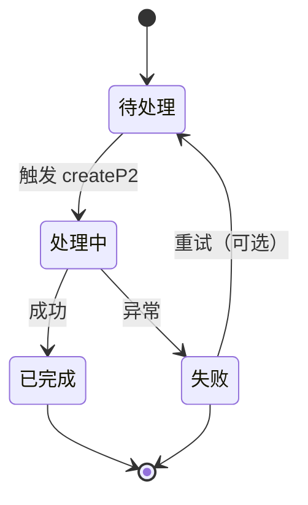
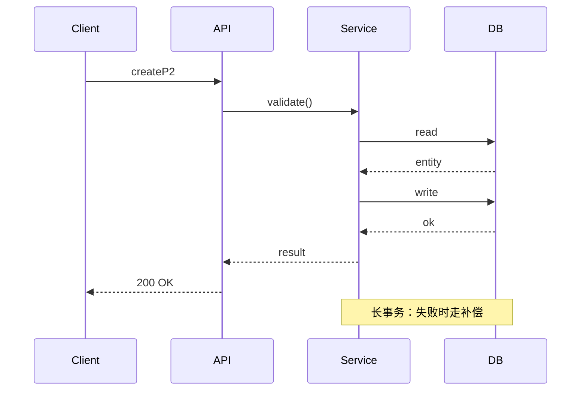

# Logic Detail: createP2

> 自动生成（来自 spec-userstory-to-design / refineLogic）
> 生成日期：2026-08-27

**功能模块**: P2-修复-编排推进
**接口 ID**: `createP2`
**复杂度信号**: stateful=true, multiParty=true, branching=true, longTx=true

---

## 1. 场景列表

| # | 类型 | 场景名 | Given | When | Then |
|---|---|---|---|---|---|
| 1 | happy | createP2 正常流 | 用户已认证且输入合法 | 调用 createP2 | 业务规则全部满足，返回成功结果 |
| 2 | error | createP2 参数校验失败 | 请求体含非法字段 | 调用 createP2 | 返回 400 + RFC 9457 Problem 详情 |
| 3 | error | createP2 业务规则冲突 | 资源状态不允许此操作 | 调用 createP2 | 返回 409 + 业务错误码 + 是否可重试标记 |
| 4 | edge | createP2 并发场景 | 两个请求同时修改同一资源 | 调用 createP2 | 后到请求应失败或走乐观锁/悲观锁 |
| 5 | edge | createP2 长事务中断 | 事务执行到一半进程崩溃 | 调用 createP2 | 补偿事务应回滚已执行步骤 |

## 2. 状态机图

## 3. 时序图

## 4. 决策表

| # | 输入条件 | 业务规则 | 动作 | 输出 |
|---|---|---|---|---|
| 1 | 输入合法 + 状态允许 | 满足 | 执行 createP2 | 200 |
| 2 | 输入合法 + 状态冲突 | 不满足 | 拒绝 | 409 |
| 3 | 输入非法 | 校验失败 | 拒绝 | 400 |
| 4 | 未认证 | 鉴权失败 | 拒绝 | 401 |
| 5 | 无权限 | 授权失败 | 拒绝 | 403 |
| 6 | 资源不存在 | 不满足 | 拒绝 | 404 |
| 7 | 内部异常 | 兜底 | 记录 traceId | 500 |

## 5. 异常分支表

| 场景 | HTTP 状态 | 业务码 | 是否可重试 | 补偿动作 |
|---|---|---|---|---|
| createP2 参数校验失败 | 400 | E1000 | 否 | - |
| createP2 业务规则冲突 | 409 | E1001 | 否 | - |
| createP2 并发场景 | 409 | E1002 | 是 | - |
| createP2 长事务中断 | 409 | E1003 | 是 | - |

---

## 6. 细化进度

- [ ] 每个场景都有 Given/When/Then
- [ ] 状态机覆盖所有状态转换
- [ ] 时序图标注失败分支
- [ ] 决策表填全所有条件组合
- [ ] 异常分支表确定 HTTP 状态 + 业务码 + 重试策略
