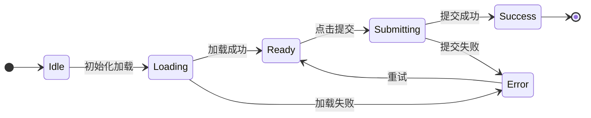
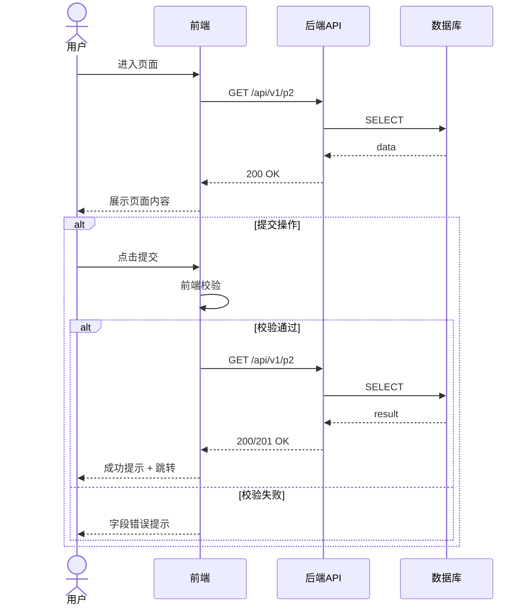

# Page Detail: P2-修复-编排推进详情页

> 自动生成（来自 spec-userstory-to-design）
> 生成日期：2026-08-27

**页面 ID**: `P-001TEST-02`
**功能模块**: P2-修复-编排推进
**来源 User Story**: US-01
**优先级**: P1
**路由**: `/p2/detail/:id`
**类型**: detail

---

## 1. 页面元信息

| 字段 | 内容 |
|---|---|
| 页面 ID | P-001TEST-02 |
| 页面名称 | P2-修复-编排推进详情页 |
| 路由路径 | /p2/detail/:id |
| 页面类型 | detail |
| 入口 | 点击列表卡片 |
| 出口 | 返回列表 / 跳转到编辑 |
| 角色权限 | 已登录用户 |
| 所属模块 | P2-修复-编排推进 |

## 2. 页面布局

| 区域 | 组件 | 说明 |
|---|---|---|
| 顶部导航 | AppHeader | Logo + 一级菜单 + 用户头像 |
| 面包屑 | Breadcrumb | 首页 / P2-修复-编排推进 / P2-修复-编排推进详情页 |
| 左侧 | Sidebar | 二级导航菜单 |
| 主内容区 | PageMainContent | 页面核心功能区 |
| 底部 | AppFooter | 版权信息 + 备案号 |

## 3. 组件清单

| ID | 组件名 | 类型 | 所属区域 | 说明 |
|---|---|---|---|---|
| C-001 | PageTitle | Typography | 主内容 | 页面标题 + 描述 |
| C-002 | ActionBar | Toolbar | 主内容 | 操作按钮组 |
| C-003 | DetailCard | Container | 主内容 | 核心内容组件 |
| C-004 | Pagination | Navigation | 主内容 | 返回按钮 |
| C-005 | ToastContainer | Feedback | 全局 | 消息提示 |

## 4. 按钮清单

| ID | 文案 | 位置 | 触发动作 | API 调用 | 前置条件 | 异常分支 |
|---|---|---|---|---|---|---|
| B-001 | 返回 | ActionBar | navigate.back | - | - | - |
| B-002 | 刷新 | ActionBar | data.reload | GET /api/v1/p2 | - | E1001 |

| B-003 | 编辑 | ActionBar | navigate.to(/p2/edit/:id) | - | 有编辑权限 | E1002
| B-004 | 删除 | ActionBar | confirm + api.delete | DELETE /api/v1/p2/:id | 有删除权限 | E1004

## 5. 数据来源 / 字段清单

| 字段名 | 类型 | 必填 | 默认值 | 校验规则 | 来源 |
|---|---|---|---|---|---|
| id | string | 是 | - | UUID v4 | 系统生成 |
| name | string | 是 | - | maxLength: 100 | 用户输入 |
| status | string | 是 | active | enum: [active, inactive, archived] | 系统/用户 |
| createdAt | string | 是 | - | ISO 8601 datetime | 系统生成 |
| updatedAt | string | 是 | - | ISO 8601 datetime | 系统生成 |
| createdBy | string | 是 | - | UUID v4 | 系统生成 |

## 6. 按钮状态机

## 7. 按钮交互时序

## 8. 错误码 / 异常处理

| 错误码 | HTTP 状态 | 用户提示 | 触发条件 | 处理建议 |
|---|---|---|---|---|
| E1001 | 500 | 加载失败，请稍后重试 | 网络错误 / 服务异常 | 自动重试 + 手动刷新 |
| E1002 | 403 | 无权限执行此操作 | 权限校验失败 | 联系管理员申请权限 |
| E1003 | 429 | 操作过于频繁，请稍后再试 | 限流触发 | 等待后重试 |
| E1004 | 404 | 数据不存在或已删除 | 资源找不到 | 返回列表页 |
| E1005 | 400 | 提交失败，请检查输入 | 参数校验失败 | 修正后重新提交 |
| E1006 | 409 | 数据已被修改，请刷新 | 并发冲突 | 刷新后重试 |

## 9. 埋点事件

| 事件名 | 触发时机 | 上报参数 |
|---|---|---|
| page_view | 页面挂载完成 | pageId, featureName, userId, referrer |
| btn_click | 点击按钮 | pageId, btnId, btnText |
| form_submit | 表单提交 | pageId, formId, success, durationMs |
| api_error | API 调用失败 | pageId, endpoint, statusCode, errorMessage |

## 10. 关联 API

> Operation ID 与正式契约 `contracts/openapi.yaml` 对齐；Path 为完整路径，对应 openapi 中 server base（/api/v1）+ path（/p2）

| Operation ID | Method | Path | 关联按钮 | 说明 |
|---|---|---|---|---|
| listP2s | GET | /api/v1/p2 | B-002, B-004 | 列表/查询 |
| getP2 | GET | /api/v1/p2/:id | B-003 | 获取详情 |
| deleteP2 | DELETE | /api/v1/p2/:id | B-004 | 删除

## 11. 验收标准

1. **US-01** - **Given** 用户已登录系统 **When** US-01 - 完成 P2 修复并验证编排状态机推进（Priority: P1） **Then** 系统正确响应，页面展示符合预期

---

*本文档由 spec-userstory-to-design 自动生成，版本 v1.0*
