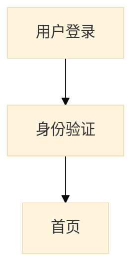

# spec-userstory-to-design

> User Story → Page Flow + Page Detail + API Contract 的端到端自动化。

## 一、能力范围

### 1.1 `/generate` 完整生成

```bash
/design.generate --from=specs/001-feature/spec.md --feature="商家接入抖音"
# 输出：
#   docs/design/001-feature/
#   ├── README.md
#   ├── page-flow.md
#   ├── page-flow.mmd           ← Mermaid 源
#   ├── pages/
#   │   ├── P-ACCT-001-account-list.md
#   │   ├── P-ACCT-002-oauth-callback.md
#   │   └── _components/        ← 状态机/时序图源
#   ├── openapi.yaml            ← OpenAPI 3.1.2
#   ├── asyncapi.yaml           ← 可选（实时事件）
#   ├── errors.json             ← 错误码目录
#   └── coverage-report.md      ← 反向校验报告
```

### 1.2 `/validate` 反向校验

```bash
/design.validate --from=docs/design/001-feature/
# 检查：
#   - 每个 User Story 至少 1 个页面节点 + 1 条主路径
#   - 每个按钮 0 或 1 个 API 调用
#   - 每个 FR 是否在 Page Detail 中可见
#   - Mermaid 语法合法性（mmdc 校验）
#   - OpenAPI 合法性（spectral 校验）
```

## 二、3 步 Pipeline

```
Input:  specs/001-feature/spec.md（Spec Kit 风格）
                │
                ▼
┌─────────────────────────────────────┐
│ Step 1: Page Flow Generator │
│ Prompt: 抽取页面节点 + 跳转边 + 判断节点 │
│ Output: page-flow.md + page-flow.mmd │
└──────────────┬──────────────────────┘
               ▼
┌─────────────────────────────────────┐
│ Step 2: Page Detail Generator │
│ Prompt: 为每个页面生成 11 章节 │
│ Output: pages/*.md + state/sequence Mermaid │
└──────────────┬──────────────────────┘
               ▼
┌─────────────────────────────────────┐
│ Step 3: API Contract Generator │
│ Prompt: 从按钮清单推导 OpenAPI 3.1.2 │
│ Output: openapi.yaml + x-page-id 锚点 │
└──────────────┬──────────────────────┘
               ▼
┌─────────────────────────────────────┐
│ Step 4: Validator │
│ Coverage report + Spectral lint + mmdc lint │
└─────────────────────────────────────┘
```

## 三、Step 1 Prompt（Page Flow Generator）

```text
你是资深 UI/UX 设计师，基于【{feature_name}】的 Spec Kit 风格 spec.md。

按以下步骤输出：

STEP 1 - 抽取页面节点
- 从每条 Acceptance Scenario 的 When/Then 中提取"动词 + 屏幕对象"
- 归一化同名页面
- 输出 JSON: [{ id, name, route, storyIds, description }]

STEP 2 - 抽取跳转边
- 识别页面切换（含 Modal/Drawer）
- 输出 JSON: [{ from, to, trigger, condition?, storyId, isAsync? }]

STEP 3 - 抽取 API/系统动作
- 识别"调用/提交/校验"动词
- 输出 JSON: [{ id, name, endpoint?, method? }]

STEP 4 - 抽取判断节点
- 输出 JSON: [{ id, condition, trueTo, falseTo, storyId }]

STEP 5 - 生成 Mermaid flowchart
- 方向：TD
- 节点形状：页面 [text] / Modal ([text]) / 入口 ((text)) / API [[text]] / 判断 {text}
- subgraph 按 User Story 分组
- 节点 ID 英文，显示文本可用中文（英文双引号包裹）

STEP 6 - 自检
- 每个 US 至少 1 个页面节点
- 每条 AC 在图中可达
- 无孤立节点

最终输出：页面清单表 + 跳转清单表 + Mermaid 代码块 + 自检报告
```

## 四、Step 2 Prompt（Page Detail Generator）

```text
你是资深 B 端产品经理，基于以下输入：
- 页面清单（来自 Step 1）
- 对应 User Story
- Page Flow 上下文

为每个页面生成 Page Detail Design，每个页面一个 H2 章节：

1. 页面元信息（ID、路由、入口、出口、角色、设备）
2. 页面布局（区域 + 组件 + 备注）
3. 组件清单（ID、名称、类型、来源组件库、备注）
4. 按钮清单（ID、文案、触发动作、前置条件、API 调用、异常分支）
5. 数据来源（字段、来源、类型、必填、校验）
6. 按钮状态机（Mermaid stateDiagram-v2）
7. 按钮交互时序（Mermaid sequenceDiagram）
8. 错误码 / 异常处理
9. 埋点
10. 关联 API（占位，由 Step 3 填充）
11. 验收标准（Given/When/Then）
```

## 五、Step 3 Prompt（API Contract Generator）

```text
你是 OpenAPI 契约生成器。基于 Page Detail 中的按钮清单，生成 OpenAPI 3.1.2 YAML。

核心规则：
1. 资源命名：复数名词，从 pageId 推导（如 /accounts）
2. HTTP 方法决策：
   - 数据展示 → GET /resources, GET /resources/{id}
   - 表单创建 → POST /resources
   - 表单编辑全量 → PUT /resources/{id}
   - 局部更新 → PATCH /resources/{id}
   - 删除 → DELETE /resources/{id}
   - 业务动作 → POST /resources/{id}/{action}
3. Schema 推导：
   - text/email/url → string (format)
   - number → number / integer
   - date → string (format: date)
   - select/radio → enum
   - checkbox → boolean
   - file → string (format: binary), multipart/form-data
4. 错误响应：每个 operation 必含 400/401/403/404/422/500，统一引用 Problem schema
5. 双向锚点：每个 operation 必含 x-page-id 和 x-button-id 扩展

校验清单：
- 所有 $ref 解析通过
- 错误响应覆盖 4xx/5xx
- 必填字段在 required 数组
- 每个 operation 有 operationId（camelCase）
- 包含 traceId、Problem+JSON schema
```

## 六、Page Detail 11 章节模板

```markdown
## Page: [页面名称] (P-XXX-NNN)

**来源 US**: US-NN
**路由**: /xxx/yyy
**优先级**: P1

### 1. 页面元信息
### 2. 页面布局
### 3. 组件清单
### 4. 按钮清单
### 5. 数据来源
### 6. 按钮状态机（Mermaid stateDiagram-v2）
### 7. 按钮交互时序（Mermaid sequenceDiagram）
### 8. 错误码 / 异常处理
### 9. 埋点
### 10. 关联 API
### 11. 验收标准（Given/When/Then）
```

## 七、OpenAPI 输出示例片段

```yaml
openapi: 3.1.2

info:
  title: 客服系统 - 账号接入 API
  version: 1.0.0
  x-generated-by: project-orchestrator/spec-userstory-to-design@1.0

tags:
  - name: Accounts
    kind: domain
  - name: Accounts.Actions
    parent: Accounts

paths:
  /accounts/{id}/{action}:
    parameters:
      - $ref: '#/components/parameters/Id'
      - name: action
        in: path
        required: true
        schema:
          type: string
          enum: [disable, enable, reauth]
    post:
      operationId: ${action}Account
      tags: [Accounts.Actions]
      x-page-id: P-ACCT-001      # ★ 双向锚点
      x-button-id: B-010         # ★ 双向锚点
      requestBody:
        required: false
        content:
          application/json:
            schema: { $ref: '#/components/schemas/AccountActionRequest' }
      responses:
        '200': { description: OK }
        '404': { $ref: '#/components/responses/NotFound' }
        '409': { $ref: '#/components/responses/Conflict' }

components:
  schemas:
    Problem:
      type: object
      required: [type, title, status, traceId]
      properties:
        type:     { type: string, format: uri }
        title:    { type: string }
        status:   { type: integer }
        detail:   { type: string }
        instance: { type: string, format: uri }
        code:     { type: string, example: "U1023" }
        category: { type: string, enum: [USER_ERROR, SYSTEM_ERROR, EXTERNAL_ERROR] }
        traceId:  { type: string }

x-page-sources:
  - pageId: P-ACCT-001
    storyId: US-02
    buttons: [B-001, B-002, B-003, B-010, B-011]
    apiCount: 5
```

## 八、Mermaid 中文显示规范



规则：
- 节点 ID 必须英文（`[A-Za-z0-9_]+`）
- 中文显示文本用英文双引号包裹
- 一行一个语句
- 不使用 `\n` 换行，使用 `<br/>`
- 箭头仅用 `-->` / `-.->` / `==>` / `-->|label|`

## 九、覆盖校验报告

```markdown
# Coverage Report - 001-feature

## User Story → Page 覆盖
- US-01 → P-XXX-001 ✓
- US-02 → P-ACCT-001 ✓
- US-03 → 无页面 ⚠️

## 按钮 → API 覆盖
- B-001 → GET /api/v1/account/oauth/douyin/url ✓
- B-010 → POST /api/v1/accounts/{id}/disable ✓
- B-099 → 无 API ❌（孤儿按钮）

## FR → Page 字段覆盖
- FR-001 → P-XXX-001.email ✓
- FR-002 → P-XXX-001.password ✓
- FR-099 → 无字段 ⚠️
```

## 十、失败回退

| 失败点 | 恢复动作 |
|---|---|
| Mermaid 语法错误 | mmdc lint + 自动 sanitize |
| OpenAPI 引用断裂 | Spectral lint + 自动修复 $ref |
| US → Page 覆盖率 < 80% | 警告 + 列出孤儿 US |
| 按钮 → API 覆盖率 < 90% | 警告 + 列出孤儿按钮 |

## 十一、依赖

- mermaid v11+（含 mermaid-cli）
- openapi v3.1+（含 spectral-cli）
- Node.js 18+

## 十二、相关链接

- 父 Skill: `project-orchestrator`
- 上游: `spec-bootstrap`, `ui-design`
- 下游: `api-contract`（合并 OpenAPI）

## 十三、许可

MIT